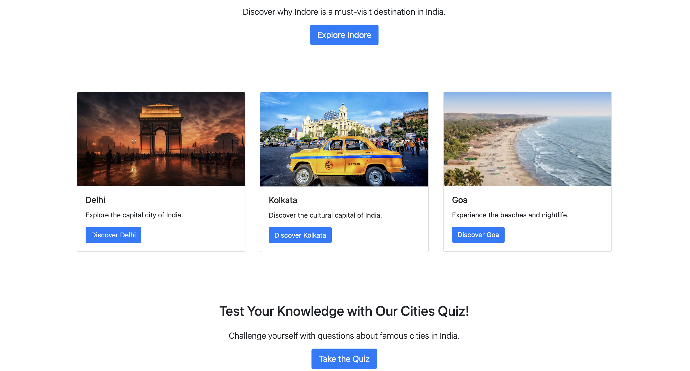
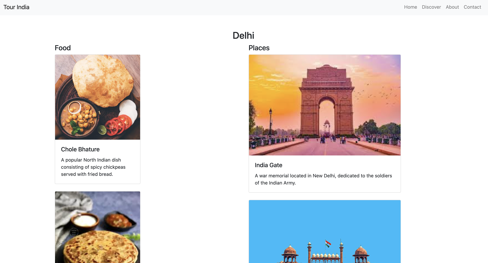
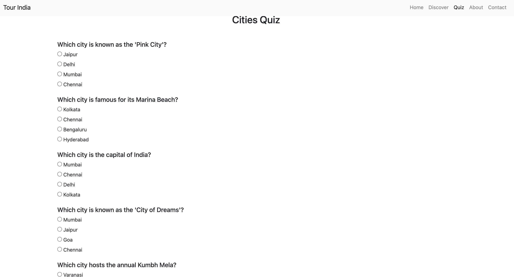
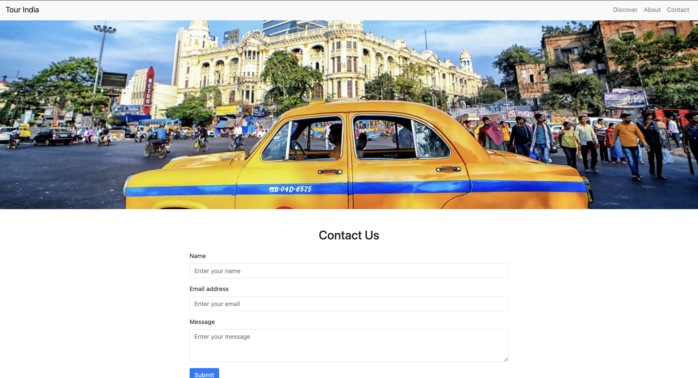

# Tour India Website
Welcome to the **Tour India** website project! This website showcases the tourist attractions of various Indian cities, including food, places, monuments, and cultural information. This README provides an overview of the project, installation instructions, and details on the website structure.

## Overview
The Tour India website is a front-end project designed to provide detailed information about different cities in India. Each city page includes sections for food, places, monuments, culture, festivals, and history.

## Features
- **Responsive Design**: Built using HTML, CSS, and Bootstrap for a responsive and user-friendly interface.
- **City Pages**: Detailed information on food, places, monuments, culture, festivals, and history of each city.
- **Contact Form**: A contact page with a form for user inquiries.
- **About Page**: Information about the project and the team behind it.
- **Trending Cities**: Highlight of the most trending cities on the home page.

## Usage

- **Home Page**: Displays a list of Indian cities and trending cities.
- **City Pages**: Click on any city to view detailed information about its attractions.
- **Contact Page**: Fill out the form to get in touch with the team.
- **About Page**: Learn more about the project.

## Screenshots

### Home Page

### Trending City (Indore)

### City Page (Delhi)

### City Quiz

### Contact Page

### About Page

